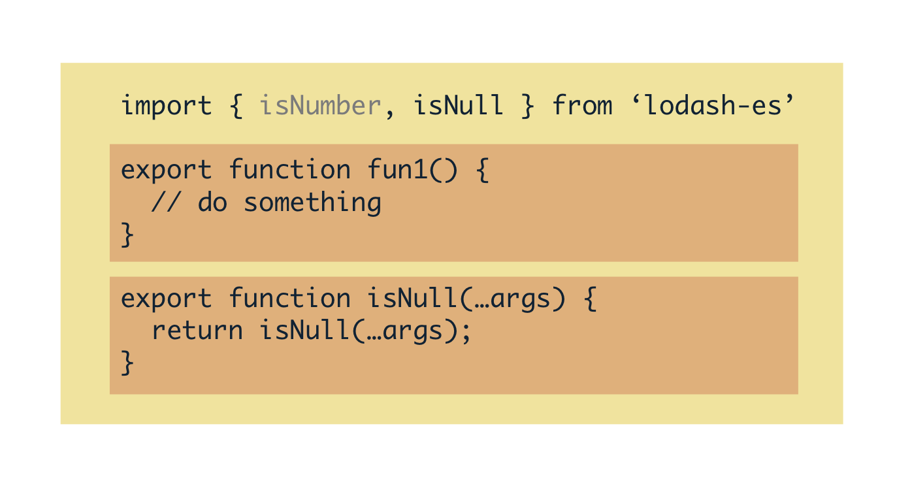
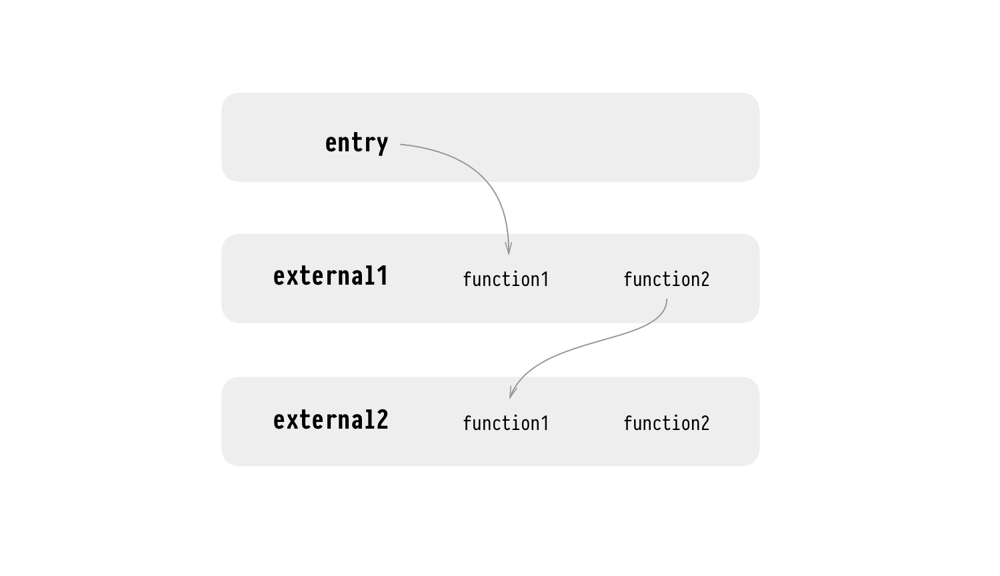
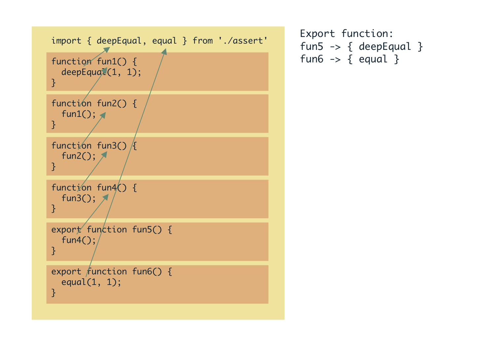
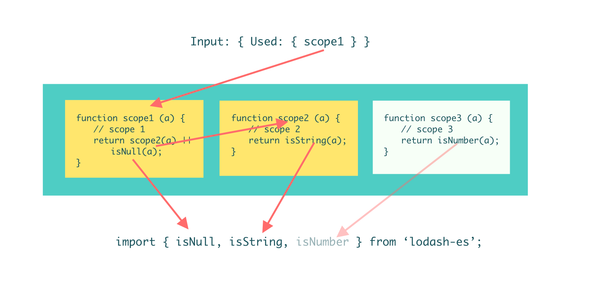

# Better Tree Shaking with Deep Scope Analysis

> From https://medium.com/webpack/better-tree-shaking-with-deep-scope-analysis-a0b788c0ce77
> 
> Author: Vincent Chan https://medium.com/@okcdz

Here’s my project in GSoC 2018: Improve tree-shaking for webpack, a widely used JS code bundler.
Introduction
Tree-shaking, a supporting feature for DCE(dead code elimination) to help DCE on cross-module usage, is a crucial feature for a bundler. It's especially true for JS. Reducing the bundle size means reducing the network cost each time a bundle is delivered for web application.

[Project on Github](https://github.com/vincentdchan/webpack-deep-scope-analysis-plugin)

[中文版](https://vincentdchan.github.io/2018/05/better-tree-shaking-with-scope-analysis/)

## Without this plugin
Before the implementation of this plugin, webpack uses a very simple solution for DCE. For example:



In the above example, webpack finds the references of the imported variables. Obviously, `isNumber` is completely not referenced in the module. As a result it can be eliminated in the final bundle if it’s never used in other modules.

The above example is very silly because you won’t import something you don’t need unless you forget to remove them. However, the modern editor and lint tools will remind you to remove unused imports. Thus we need a more powerful solution.

## Motivation

> Unexpected code after tree-shake · Issue #6264 · webpack/webpack https://github.com/webpack/webpack/issues/6264

Do you want to request a feature or report a bug? Either a bug or unclear docs. What is the current behavior? Given…
github.com	
The above issue illustrates that Webpack tree shaking mechanism still has some room for improvement. We can find out the relationships between the exported variables and imported variables among modules.

If an exported variable is not imported by another module, it will be eliminated along with its “children”(Other variables that are only referenced by it).


Image from the above issue

`Function2` is not imported by the **`entry`**, `function2` and the entire **`external2`** can be eliminated. Unfortunately, webpack’s previous mechanism couldn’t catch such case until the introduction of this new plugin.

## Feasibility
Think about the role of webpack: it traverses the graph of all modules from entry and bundles them together. At the same time, webpack knows which exports are used. How about traversing all the scopes and bundle the scopes together? That’s the way it can eliminate unused scopes and module. In fact, we can regard scope as a node in the graph.



In the above code, `deepEqual` is related to `fun5`, `equal` is related to `fun6`. If `fun6` is not imported by another module, the imported function `equal` would be eliminated.

## What is a scope?
> In [computer programming](https://en.wikipedia.org/wiki/Computer_programming), the **scope** of a [name binding ](https://en.wikipedia.org/wiki/Name_binding)— an association of a name to an entity, such as a [variable](https://en.wikipedia.org/wiki/Variable_%28programming%29) — is the region of a [computer program](https://en.wikipedia.org/wiki/Computer_program) where the binding is valid: where the name can be used to refer to the entity. Such a region is referred to as a **scope block**. In other parts of the program the name may refer to a different entity (it may have a different binding), or to nothing at all (it may be unbound). — Wikipedia

Where you can feel scope when you are coding is something like **block** in the code. But it’s not quite equivalent. Here are types of scopes in ECMAScript:

```js
// module scope start

// Block

{ // <- scope start
} // <- scope end

// Class

class Foo { // <- scope start

} // <- scope end

// If else

if (true) { // <- scope start
   
} /* <- scope end */ else { // <- scope start
  
} // <- scope end

// For

for (;;) { // <- scope start
} // <- scope end

// Catch

try {

} catch (e) { // <- scope start

} // <- scope end

// Function

function() { // <- scope start
} // <- scope end

// Scope

switch() { // <- scope start
} // <- scope end

// module scope end
```

For a ES6 module, module scope is regarded as a root scope. Within the module, only scopes of `class` and `function` can be exported, they are children of module scope. So not all the scopes would be regarded as a node in the graph.

## How this plugin works
This plugin contains a scope analyzer, which can extract all the scopes from modules. The output of the analyzer would then be used to find out the references of variables in the module.

Some of scopes could be bound to variables, such as class and function. These scopes that are exported is the atom for traversing.


This plugin analyses the relationships between imports and exports.

When webpack gives inputs about which exports are used, this plugin returns which imports could be eliminated.

## Implementation Details
> If I have seen further it is only by standing on the shoulders of giants. — Isaac Newton

We need a scope analysis to find the references between variables. An existing tool like https://github.com/estools/escope could help.

This scope analysis is based on the ASTs. The plugin hooks the webpack to acquire ASTs of modules, and analyzes them.

Then, the analyzer finds out all the scopes belong to **module scope(the root scope)**, with the referencing data of the imports. If we can know which scopes is used by other modules, the analyzer can traverse all child scopes and tag all the variables from other modules. The imports which have no tag can be regarded as unused.

## Edge cases
> To improve is to change; to be perfect is to change often. — Churchill

There are many edge cases for JavaScript analysis, some of them are listed below:

Here’s a simple demo to try:

https://vincentdchan.github.io/webpack-deep-scope-demo/

### Local References by Module Scope

```js
import { isNull } from 'lodash-es';

export function scope(...args) {
  return isNull(...args);
}

console.log(scope(null));
```

If a scope or an imported variable is referenced in module scope, it wouldn’t be eliminated.

### Re-assign function to a variable 👎

```js
import { isNull } from 'lodash-es';

var fun = 1;

fun = function scope(...args) {
  return isNull(...args);
}

export { fun }
```

Because of the lack of [data-flow analysis](https://en.wikipedia.org/wiki/Data-flow_analysis), any operation about writing a variable(such as re-assigning) would make the analysis skip this variable. Therefore, isNull will not be eliminated in the above example.

If a function expression is assigned once when the variable is declared, the function would be regarded as an independent scope, the analysis will work.

### Pure function call 👍

```js
// copy from rambda/es/allPass.js
import _curry1 from './internal/_curry1';
import curryN from './curryN';
import max from './max';
import pluck from './pluck';

var allPass = /*#__PURE__*/_curry1(function allPass(preds) {
  return curryN(reduce(max, 0, pluck('length', preds)), function () {
    var idx = 0;
    var len = preds.length;
    while (idx < len) {
      if (!preds[idx].apply(this, arguments)) {
        return false;
      }
      idx += 1;
    }
    return true;
  });
});
export default allPass;
```

If an anonymous function is wrapped in a function call, the analyzer will not regard it as a independent scope because the function call could have side effects. But if the function call is tagged as pure, the analyzer can regard it as a scope like structure. Therefore, if allPass is not used, all the variables would be eliminated.

## Practical Advice
There several practical advices for this plugin:

### ES6 module is required
Actually, the analysis is based on the ES6 module, which is known as import/export syntaxes. It can’t work on other module system such as CommonJS/AMD… Hence, the project is required to use ES6 module. For example, use lodash-es instead of lodash. Otherwise, focus on the configuration for babel-loader, TypeScript, etc. Prevent them to transpile your code into ES5 style, which can lead to failure of analysis.

### Use PURE annotation for pure function call
This plugin can’t infer whether a function contains side effects. So /*@__PURE__*/ annotation is required for some export function call, which is first introduced by Uglify. Of cause you can use some babel plugins to add them automatically. And please notice that don’t let another compiler such as babel or ts-loader to erase the comments.

## Summary
**With this plugin, webpack does better tree-shaking. It helps eliminate dead code and shrink the size of bundle.** On the other side, it requires the programmers to write clean and appropriate code because _even the best compiler can not optimize the worst code_. Now we have a better webpack, do you have some awesome code to be compiled? Please submit before and after usage stories so we can better understand how effective this is on your project/framework!